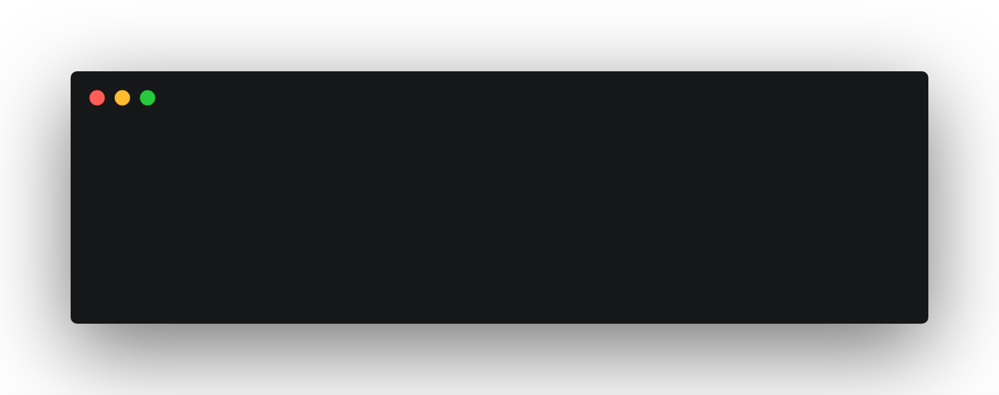

<h1 align="center">Gerbera</h1>

<p align="center">
  
  
  
  
</p>

<br>

<p align="center">
  <b>An opinionated CLI to scaffold Gutenberg blocks that are easy to customize.</b><br>
  <sub>Because a good project structure is the hardest thing in life ▌</sub>
</p>

<p align="center">
  <br>
  <sub>(Examples shown use <a href="#survey-prompt">Carbon</a>)</a></sub>
</p>

<br>

Gerbera is a highly opinionated take on Gutenberg project structure and automates a lot of the menial tasks like scaffolding, so you don't have to. This package is useful for:

* **Easy to use** - Only a few commands to get started!
* **Lightweight** - One dependency, we handle building and generating new projects all in one place.
* **Hot Reloading** - Leverage [webpack-dev-servers](https://github.com/webpack/webpack-dev-server) handy hot reloading capabilities to remove the need to refresh after every change.
* **Docker** - Setting up wordpress can be a pain, so we optonally allow you use a docker image to speed up your workflow.
* **Friendly Errors** - We use `react-dev-utils` to provide friendly errors messages.

If you like what we do, please consider starring or tweeting about this project to show your support. Thanks!

<br>

## ❯ Getting started

Get started with Gerbera, with a few simple terminal commands (windows support coming very soon!)

* [Install](#-install)
* [Usage](#-usage)
  - [Block Creation](#-creation)
  - [Development](#-development)
  - [Building](#-building)
* [Structure](#-structure)
* [About](#-about)

<br>

## ❯ Install

Install globally with [npm](https://www.npmjs.com/):

```sh
$ npm install @gerbera/cli --save
```
Use with [npx](https://yarnpkg.com/en/):

```sh
$ npx @gerbera/cli <command>
```

<small>_(Requires Node.js 8.6 or higher. Please let us know if you need support for an earlier version by creating an [issue](../../issues/new).)_</small>

<br>

## ❯ Usage

### Block Creation

The easiest way to get started with gerbera is to run the `create` command.

<div align="center">
  <br>
</div>

```sh
$ npx @gerbera/cli create example-block
cd example-block
```

<small>⚠️This example uses `npx`, but if you installed globally you can just use `npm`.</small>

<br>

### Development

Once everything is created, you can go into your folder and run the development script.

<div align="center">
  <br>
</div>

```sh
$ npm run serve <params>
```
<br>

**Params**

* `docker` **{String}**: (optional) Creates a docker instance with the wordpress imge.

<br>

### Production 

To produce production code run `npm run build`, which minifies and uglified code by default.

<div align="center">
  <br>
</div>

```sh
$ npm run build
```

<small>ℹ️You will see the build messages, errors, and lint warnings in the console.</small>

<br>

## ❯ Structure

We generate a default project structure that we feel fits our needs (and maybe yours too). A well nested project strcuture which handles css, js and of course react components.

```
├── client
| ├── common
| | └── common.scss
| ├── example
| | ├── components
| | ├── scripts
| | ├── styles
| | ├── block.js
| | ├── edit.js
| | ├── inspector.js
| | └── save.js
| └── blocks.js
├── server
| └── blocks.php
├── package-lock.json
├── package.json
└── plugin.php
 ```


### Configuration File 

We create a config file called `gerbera.config.js` which contains various information we use to automate the webpack builds (e.g. creating js files to enqueue scripts). An example is below:

```js
{
  name: String | Project Name
  namespace: String | Desired Namespace
}
```

<br>

## ❯ About

This project was an excuse for me to learn about: creating a node cli, publising to npm, writing to files and piping and in general learn from other useful packages. Inspired by [CreateGutenBlock](https://github.com/ahmadawais/create-guten-block) and [GutenBlock](https://github.com/zackify/gutenblock). 